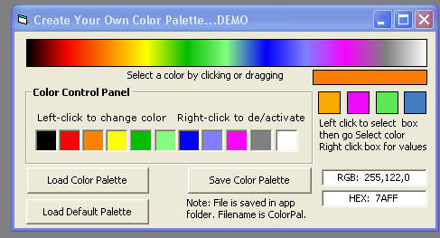



## Custom Color Palette on the Fly

### Description

Create a custom color palette in runtime. I built this DEMO around redbird77's mgradient.bas.Remember this is only a demo. What you do with it is up to you. Hope someone finds it helpful.Oh yeah,you can save and load your base colors.
 
### More Info
 

             |
---                |---
**Submitted On**   |2005-06-01 06:17:38
**By**             |[Kenneth Foster](https://github.com/Planet-Source-Code/PSCIndex/blob/master/ByAuthor/kenneth-foster.md)
**Level**          |Intermediate
**User Rating**    |5.0 (15 globes from 3 users)
**Compatibility**  |VB 6\.0
**Category**       |[Graphics](https://github.com/Planet-Source-Code/PSCIndex/blob/master/ByCategory/graphics__1-46.md)
**World**          |[Visual Basic](https://github.com/Planet-Source-Code/PSCIndex/blob/master/ByWorld/visual-basic.md)
**Archive File**   |[Custom\_Col189557612005\.zip](https://github.com/Planet-Source-Code/kenneth-foster-custom-color-palette-on-the-fly__1-60840/archive/master.zip)

